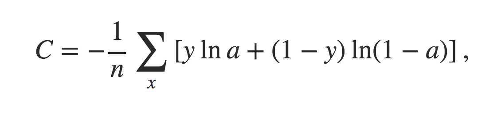
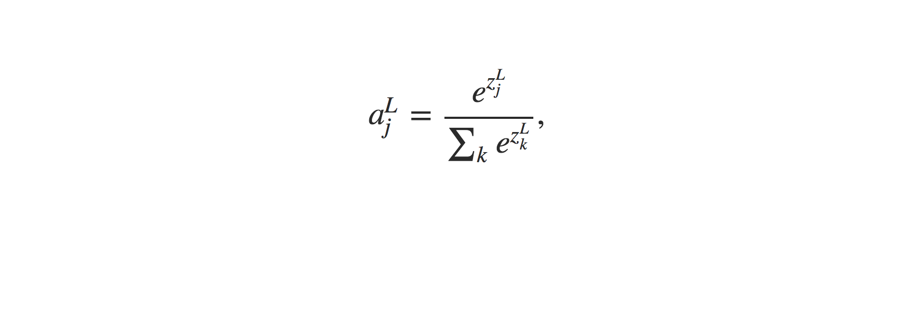
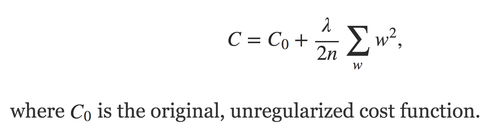
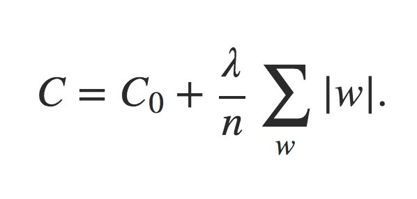
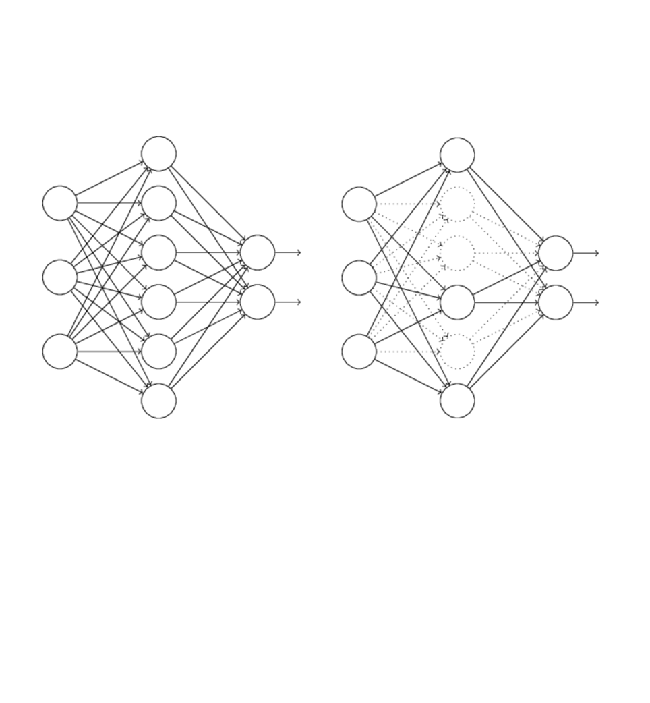

# dlnd
Udacity's Deep Learning Foundation Nanodegree Program

## Cross-Entropy

- How can we address the learning slowdown?
    - Replacing the `quadratic cost` with a different cost function, known as the `cross-entropy`.
    - We often learn fastest when we're badly wrong about something.
- [Introducing the cross-entropy cost function](http://neuralnetworksanddeeplearning.com/chap3.html#introducing_the_cross-entropy_cost_function)
    

## Softmax

- The idea of `softmax` is to define a new type of output layer for our neural networks
    - http://neuralnetworksanddeeplearning.com/chap3.html#softmax
    - However, we don't apply the `sigmoid function` to get the output. 
    - Instead, in a `softmax layer` we apply the so-called `softmax function`
    

## [Overfitting and regularization](http://neuralnetworksanddeeplearning.com/chap3.html#overfitting_and_regularization)

- In general, one of the best ways of reducing overfitting is to increase the size of the training data. 
    - Unfortunately, training data can be expensive or difficult to acquire, so this is not always a practical option.
- [Regularization](http://neuralnetworksanddeeplearning.com/chap3.html#regularization)
    - `weight decay` or `L2 regularization`
    - The idea of `L2 regularization` is to add an extra term to the cost function, a term called the regularization term.
    
    - Heuristically, if the cost function is unregularized, then the length of the weight vector is likely to grow, all other things being equal. 
    - Over time this can lead to the weight vector being very large indeed. 
    - This can cause the weight vector to get stuck pointing in more or less the same direction, since changes due to gradient descent only make tiny changes to the direction, when the length is long.

- [Other techniques for regularization](http://neuralnetworksanddeeplearning.com/chap3.html#other_techniques_for_regularization)
    - L1 regularization
        - 
    - Dropout
        - Dropout doesn't rely on modifying the `cost function`. 
        - Instead, in dropout we modify the `network` itself.
        - Dropout has been especially useful in training large, deep networks, where the problem of overfitting is often acute.
        - Start by randomly (and temporarily) deleting half the hidden neurons in the network, while leaving the input and output neurons untouched.
        

    - Artificially increasing the training set 

## [Weight initialization](http://neuralnetworksanddeeplearning.com/chap3#weight_initialization)

- We can do quite a bit better than initializing with normalized `Gaussians`
- [Hands On](https://github.com/udacity/deep-learning/blob/master/weight-initialization/weight_initialization.ipynb)
- General rule for setting weights
  - The general rule for setting the weights in a neural network is to be close to zero without being too small.
  - A good pracitce is to start your weights in the range of $[-y, y]$ where $y=1/\sqrt{n}$ ($n$ is the number of inputs to a given neuron).

## [Introducing convolutional networks](http://neuralnetworksanddeeplearning.com/chap6.html#introducing_convolutional_networks)

- **Adjacent layers**
     
- **Local receptive fields**
     
- **Shared weights and biases**
    - To use the same `weights` and `bias` for each of the hidden neurons.
    - This means that all the neurons in the first hidden layer detect exactly the same feature just at different locations in the input image.
- **Pooling Layers**
    - A pooling layer takes each feature map, output from the convolutional layer and prepares a condensed feature map
    - Max Pooling
         
- **Putting it all together**
         
