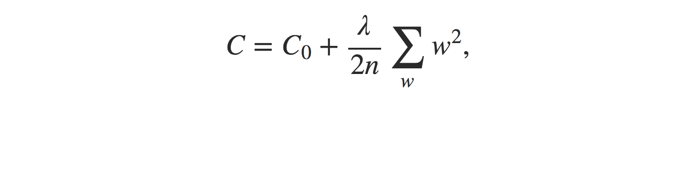

# dlnd
Udacity's Deep Learning Foundation Nanodegree Program

## Cross-Entropy

- How can we address the learning slowdown?
    - Replacing the `quadratic cost` with a different cost function, known as the `cross-entropy`.
    - We often learn fastest when we're badly wrong about something.
- [Introducing the cross-entropy cost function](http://neuralnetworksanddeeplearning.com/chap3.html#introducing_the_cross-entropy_cost_function)
    

## Softmax

- The idea of `softmax` is to define a new type of output layer for our neural networks
    - http://neuralnetworksanddeeplearning.com/chap3.html#softmax
    - However, we don't apply the `sigmoid function` to get the output. 
    - Instead, in a `softmax layer` we apply the so-called `softmax function`
    

## [Overfitting and regularization](http://neuralnetworksanddeeplearning.com/chap3.html#overfitting_and_regularization)

- In general, one of the best ways of reducing overfitting is to increase the size of the training data. 
    - Unfortunately, training data can be expensive or difficult to acquire, so this is not always a practical option.
- [Regularization](http://neuralnetworksanddeeplearning.com/chap3.html#regularization)
    - `weight decay` or `L2 regularization`
    - The idea of `L2 regularization` is to add an extra term to the cost function, a term called the regularization term.
    
